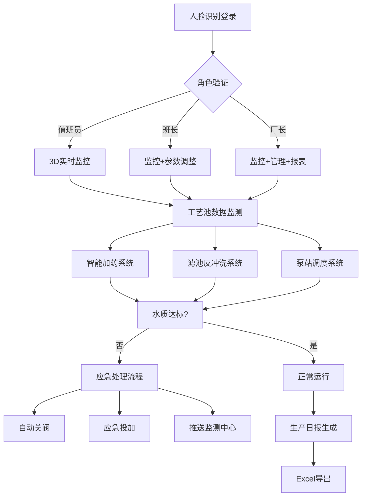

## 1. 产品概述

3D智慧水厂生产调度与水质保障可视化平台，通过三维可视化技术实现水厂全工艺流程的实时监控与智能调度，覆盖原水取水口、反应沉淀池、滤池、清水池、加药间、送水泵房和中央控制室七大核心区域。平台整合水质监测、智能加药、自动反冲洗、泵站优化调度、设备管理、应急处理等功能，实现水厂生产的数字化、智能化、可视化管理。

- 主要用途：水厂生产运营监控、工艺参数优化、水质安全保障、设备全生命周期管理
- 目标用户：水厂厂长、运行班长、值班操作人员、设备维护人员
- 核心价值：提升水质达标率、降低生产能耗、减少人工干预、保障供水安全、实现精细化管理

## 2. 核心功能

### 2.1 用户角色

| 角色 | 登录方式 | 核心权限 |
|------|---------|---------|
| 值班员 | 人脸识别登录 | 实时监控、数据查看、报警确认、操作日志记录 |
| 班长 | 人脸识别登录 | 值班员所有权限 + 参数调整、工单审核、日报导出 |
| 厂长 | 人脸识别登录 | 班长所有权限 + 系统配置、权限管理、数据分析、报表审批 |

### 2.2 功能模块

1. **登录页**：人脸识别登录界面、角色选择、操作日志记录
2. **3D监控主页**：水厂全景3D场景、工艺池实时数据、水质指标监控、运行状态总览
3. **智能加药系统**：混凝剂投加量自动计算、药剂管道流动动画、超量/欠量预警
4. **滤池反冲洗系统**：水头损失监测、反冲洗周期自动分配、气泡动画、优先级排队
5. **送水泵房调度**：水位/压力监控、泵组自动调节、备用泵自动启动、阀门3D旋转动画
6. **设备管理系统**：运行时间累计、保养阈值预警、检修工单生成、备件库联动
7. **水质应急处理**：异常检测、自动关阀、应急投加、监测中心推送
8. **趋势分析页**：24小时水质/水量趋势曲线、多参数对比分析
9. **生产日报页**：日处理量统计、水质达标率、能耗分析、Excel导出

### 2.3 页面详情

| 页面名称 | 模块名称 | 功能描述 |
|---------|---------|---------|
| 登录页 | 人脸识别模块 | 摄像头采集人脸图像、身份验证、角色识别、登录时间记录 |
| 3D监控主页 | 全景3D场景 | 可交互3D水厂模型、7大工艺区域、自由视角切换、点击查看详情 |
| 3D监控主页 | 工艺池数据面板 | 显示池编号、当前处理水量、浊度、pH、余氯、状态指示灯 |
| 3D监控主页 | 实时报警面板 | 分级报警显示（红色严重/黄色警告）、报警确认、处理记录 |
| 智能加药系统 | 投加量计算 | 根据原水浊度和流量自动计算最佳混凝剂投加量、实时调整 |
| 智能加药系统 | 管道动画 | 药剂管道流动粒子动画、流量大小可视化、超量/欠量颜色预警 |
| 滤池反冲洗系统 | 周期调度 | 水头损失和出水浊度综合分析、自动分配反冲洗周期、优先级排队 |
| 滤池反冲洗系统 | 气泡动画 | 反冲洗时3D气泡上升动画、冲洗强度可视化、进度指示 |
| 送水泵房调度 | 泵组控制 | 根据水位和压力自动调节运行台数和频率、PID闭环控制 |
| 送水泵房调度 | 阀门动画 | 阀门开关3D旋转动画、状态指示、开关到位反馈 |
| 设备管理系统 | 状态监控 | 加药泵、鼓风机累计运行时间、保养倒计时、健康度评估 |
| 设备管理系统 | 工单管理 | 超阈值自动生成检修工单、通知备件库、工单状态跟踪 |
| 水质应急处理 | 异常响应 | 浊度超标自动关闭出水阀、启动应急投加、推送监测中心 |
| 趋势分析页 | 曲线分析 | 点击工艺池弹出24小时趋势曲线、多参数叠加、数据导出 |
| 生产日报页 | 报表生成 | 按日期查询、各工艺段处理量、水质达标率、能耗统计、Excel导出 |

## 3. 核心流程

### 3.1 用户登录流程
用户进入系统 → 人脸识别验证 → 角色权限识别 → 加载对应功能界面 → 记录操作日志

### 3.2 智能加药流程
原水浊度/流量实时采集 → 智能算法计算最佳投加量 → 控制加药泵运行 → 管道流动动画显示 → 监测投加效果 → 超量/欠量预警

### 3.3 滤池反冲洗流程
水头损失/出水浊度监测 → 判断是否需要反冲洗 → 多滤池优先级排队 → 执行反冲洗程序 → 气泡动画显示 → 冲洗完成恢复过滤

### 3.4 应急处理流程
水质参数异常检测 → 触发三级报警 → 自动关闭对应出水阀 → 启动应急投加系统 → 推送消息至监测中心 → 记录处理过程

### 3.5 业务流程图

## 4. 用户界面设计

### 4.1 设计风格
- **设计主题**：工业科技风 + 数据可视化，融合流体动力学美感
- **主色调**：深海蓝 `#0A1628`（背景）、科技青 `#00D4FF`（主色）、警示红 `#FF4757`（报警）、活力橙 `#FFA502`（警告）、成功绿 `#2ED573`（正常）
- **辅助色**：渐变水蓝 `#1E90FF` → `#00CED1` 用于水体效果，金属银灰用于设备材质
- **按钮风格**：圆角矩形按钮，悬浮时发光效果，边框带呼吸动画
- **字体**：标题使用 `Orbitron` 科技感字体，正文使用 `Noto Sans SC` 清晰易读
- **布局风格**：3D场景居中占70%区域，左右两侧半透明数据面板，底部状态栏，悬浮式控制面板
- **图标风格**：线性科技图标，数据状态用色点指示
- **视觉特效**：辉光效果、扫描线、粒子系统、全息投影质感

### 4.2 页面设计概述

| 页面名称 | 模块名称 | UI元素 |
|---------|---------|--------|
| 登录页 | 人脸识别模块 | 全屏深色背景、人脸识别框（带扫描线动画）、角色选择卡片、登录按钮、水面波纹背景动画 |
| 3D监控主页 | 全景3D场景 | 沉浸式3D水厂场景、第一人称/轨道相机切换、工艺区域高亮、点击选中效果、水面反光、管道流动光效 |
| 3D监控主页 | 工艺池数据面板 | 半透明玻璃态卡片、实时数据跳动动画、水质状态色环、趋势迷你图、点击展开详情 |
| 3D监控主页 | 实时报警面板 | 右侧悬浮抽屉、报警条目按时间排序、分级颜色标识、闪烁动画、确认按钮 |
| 智能加药系统 | 管道动画 | 3D管道模型、流动粒子轨迹、流速控制、投加量仪表盘、流量异常时管道变红闪烁 |
| 滤池反冲洗系统 | 气泡动画 | 3D滤池模型、气泡粒子系统上升、冲洗强度进度条、水流动画、排队状态指示 |
| 送水泵房调度 | 阀门动画 | 3D水泵模型、阀门旋转动画（90度旋转）、电机转动效果、压力/流量仪表盘 |
| 趋势分析页 | 曲线分析 | 弹出式模态框、ECharts折线图、时间轴缩放、多参数切换、数据点悬浮提示 |
| 生产日报页 | 报表生成 | 日期选择器、数据表格、柱状图对比、达标率环形图、导出按钮 |

### 4.3 响应式设计
- **桌面优先**：针对27寸以上监控大屏优化，支持4K分辨率
- **自适应布局**：1920×1080为基准设计，使用Flex/Grid布局，rem单位适配
- **触控优化**：按钮最小尺寸48px，滑动手势支持3D场景旋转缩放
- **多屏支持**：支持分屏显示，3D场景与数据面板可分离到不同显示器

### 4.4 3D场景指导

#### 环境与氛围
- **HDRI环境贴图**：使用工业室内/黄昏户外HDR，营造真实光照环境
- **背景**：深蓝渐变天空 + 远处城市轮廓剪影 + 星空粒子
- **雾效**：轻微体积雾，增强场景纵深感，远处物体渐隐
- **后处理**：Bloom泛光效果（辉光）、轻微色差、ACES电影色调映射

#### 光照设置
- **主光源**：方向光模拟阳光，色温4000K暖白色，投射柔和阴影
- **环境光**：半球光，天空色浅蓝色，地面色深蓝色
- **点光源**：各工艺区域设置特色点光源，加药间用橙色光，滤池用青色光
- **发光材质**：管道、仪表盘、指示灯使用自发光材质，增强科技感

#### 相机设置
- **默认相机**：轨道控制器，35mm焦距，初始视角俯瞰全厂
- **相机预设**：一键切换到各工艺区域特写视角
- **运动**：平滑过渡动画，阻尼系数0.05，旋转角度限制
- **交互**：鼠标左键旋转、右键平移、滚轮缩放、双击聚焦

#### 场景构图
- **核心区域**：中央控制室位于场景中心视觉焦点
- **工艺流线**：从左到右布置取水口→反应沉淀池→滤池→清水池→送水泵房
- **辅助设施**：加药间靠近反应沉淀池，中控室位于高架位置
- **视觉层次**：水体半透明、设备金属质感、管道彩色发光区分介质

#### 交互与动画
- **悬停效果**：鼠标悬停时工艺池高亮、显示数据标签
- **点击交互**：点击弹出详情面板、播放24小时趋势曲线
- **流体动画**：水面波动、管道粒子流动、气泡上升
- **设备动画**：水泵叶轮旋转、阀门开关旋转、加药泵柱塞往复运动
- **状态动画**：正常时缓慢呼吸灯效果，报警时红色闪烁

#### 性能优化
- **模型面数控制**：总面数控制在10万面以内，使用LOD细节层次
- **实例化渲染**：大量重复设备（如阀门、仪表）使用InstancedMesh
- **纹理压缩**：使用KTX2压缩纹理，单张纹理不超过2048×2048
- **FPS目标**：稳定60fps，最低不低于30fps
