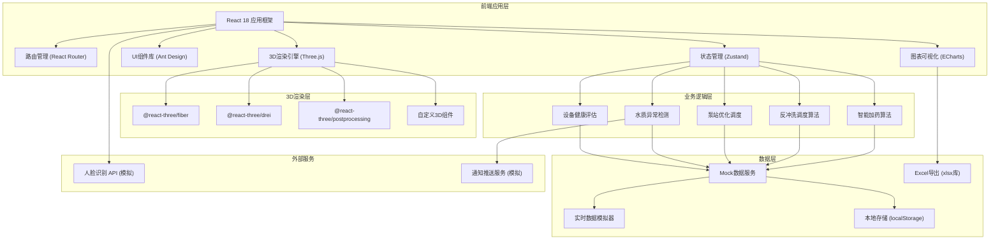
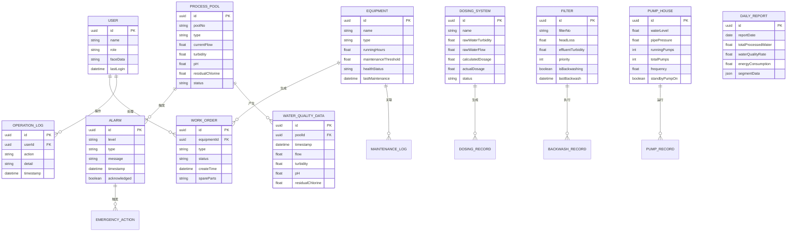

## 1. 架构设计



## 2. 技术描述

- **前端框架**：React 18.2.0 + TypeScript 5.3.0
- **构建工具**：Vite 5.0.0
- **3D引擎**：Three.js 0.160.0 + @react-three/fiber 8.15.0 + @react-three/drei 9.92.0 + @react-three/postprocessing 2.15.0
- **状态管理**：Zustand 4.4.7（轻量级，适合实时数据更新）
- **UI组件**：Ant Design 5.12.0
- **图表可视化**：ECharts 5.4.3 + echarts-for-react 3.0.2
- **样式方案**：TailwindCSS 3.4.0 + CSS Modules
- **Excel导出**：xlsx 0.18.5
- **路由管理**：React Router v6.20.0
- **日期处理**：dayjs 1.11.10
- **图标库**：@ant-design/icons 5.2.6
- **动画库**：framer-motion 10.16.5（UI动效）

## 3. 路由定义

| 路由 | 页面 | 权限要求 | 功能说明 |
|------|------|---------|---------|
| `/login` | 登录页 | 公开 | 人脸识别登录、角色选择 |
| `/` | 3D监控主页 | 登录用户 | 水厂全景3D监控、实时数据、报警面板 |
| `/trend/:poolId` | 趋势分析页 | 登录用户 | 24小时水质/水量趋势曲线 |
| `/report` | 生产日报页 | 班长及以上 | 日报查询、统计分析、Excel导出 |
| `/equipment` | 设备管理页 | 班长及以上 | 设备状态、检修工单、保养管理 |
| `/settings` | 系统设置页 | 厂长 | 参数配置、权限管理、阈值设置 |
| `*` | 404页面 | 公开 | 页面未找到提示 |

## 4. 数据模型

### 4.1 实体关系图



### 4.2 核心数据接口定义

```typescript
// 工艺池数据
interface ProcessPool {
  id: string;
  poolNo: string;
  type: 'intake' | 'sedimentation' | 'filter' | 'clearWater' | 'dosing' | 'pumpHouse' | 'controlRoom';
  currentFlow: number;
  turbidity: number;
  pH: number;
  residualChlorine: number;
  status: 'normal' | 'warning' | 'alarm';
  position: [number, number, number];
}

// 水质历史数据
interface WaterQualityData {
  timestamp: number;
  flow: number;
  turbidity: number;
  pH: number;
  residualChlorine: number;
}

// 加药系统数据
interface DosingData {
  id: string;
  rawWaterTurbidity: number;
  rawWaterFlow: number;
  calculatedDosage: number;
  actualDosage: number;
  status: 'normal' | 'over' | 'under';
}

// 滤池数据
interface FilterData {
  id: string;
  filterNo: string;
  headLoss: number;
  effluentTurbidity: number;
  priority: number;
  isBackwashing: boolean;
  backwashProgress: number;
}

// 泵站数据
interface PumpHouseData {
  waterLevel: number;
  pipePressure: number;
  runningPumps: number;
  totalPumps: number;
  frequency: number;
  standbyPumpOn: boolean;
  valveStatus: Record<string, 'open' | 'closed' | 'opening' | 'closing'>;
}

// 设备数据
interface Equipment {
  id: string;
  name: string;
  type: 'dosingPump' | 'blower' | 'valve' | 'pump';
  runningHours: number;
  maintenanceThreshold: number;
  healthStatus: 'good' | 'warning' | 'maintenance';
}

// 报警数据
interface Alarm {
  id: string;
  level: 'info' | 'warning' | 'danger';
  type: string;
  message: string;
  timestamp: number;
  acknowledged: boolean;
}

// 工单数据
interface WorkOrder {
  id: string;
  equipmentId: string;
  equipmentName: string;
  type: 'maintenance' | 'repair' | 'inspection';
  status: 'pending' | 'inProgress' | 'completed';
  createTime: number;
  spareParts: string[];
}

// 用户数据
interface User {
  id: string;
  name: string;
  role: 'operator' | 'supervisor' | 'manager';
  lastLogin: number;
}

// 日报数据
interface DailyReport {
  reportDate: string;
  totalProcessedWater: number;
  waterQualityRate: number;
  energyConsumption: number;
  segmentData: {
    name: string;
    processedWater: number;
    qualityRate: number;
    energy: number;
  }[];
}
```

## 5. 核心算法定义

### 5.1 智能加药算法
```typescript
// 根据原水浊度和流量计算最佳混凝剂投加量
function calculateOptimalDosage(turbidity: number, flow: number): number {
  // 基础投加量系数 (mg/L)
  const baseCoefficient = 0.8;
  // 浊度影响系数
  const turbidityFactor = Math.pow(turbidity / 5, 0.6);
  // 流量修正系数
  const flowFactor = 1 + (flow - 1000) * 0.0001;
  // 计算投加量 (kg/h)
  const dosage = baseCoefficient * turbidityFactor * flowFactor * flow * 24 / 1000;
  return Math.max(10, Math.min(200, Math.round(dosage * 100) / 100));
}
```

### 5.2 反冲洗优先级算法
```typescript
// 计算滤池反冲洗优先级
function calculateBackwashPriority(filter: FilterData): number {
  // 水头损失权重 (最大3.0m为100分)
  const headLossScore = Math.min(100, (filter.headLoss / 3.0) * 100) * 0.6;
  // 出水浊度权重 (最大1.0NTU为100分)
  const turbidityScore = Math.min(100, (filter.effluentTurbidity / 1.0) * 100) * 0.4;
  // 距上次冲洗时间加成
  const hoursSinceLastWash = (Date.now() - filter.lastBackwash) / (1000 * 60 * 60);
  const timeBonus = Math.min(20, hoursSinceLastWash * 0.5);
  
  return Math.round(headLossScore + turbidityScore + timeBonus);
}
```

### 5.3 泵站调度算法
```typescript
// 根据水位和压力调节泵组运行
function optimizePumpOperation(
  waterLevel: number, 
  pipePressure: number,
  setPoint: number = 0.35
): { runningPumps: number; frequency: number; startStandby: boolean } {
  const pressureError = setPoint - pipePressure;
  const levelFactor = waterLevel / 4.0; // 4米满水位
  
  let runningPumps = 2;
  let frequency = 50;
  let startStandby = false;
  
  // 压力过低
  if (pressureError > 0.05) {
    runningPumps = Math.min(4, runningPumps + 1);
    frequency = Math.min(55, frequency + 5);
    if (pressureError > 0.1) startStandby = true;
  }
  // 压力过高
  else if (pressureError < -0.05) {
    runningPumps = Math.max(1, runningPumps - 1);
    frequency = Math.max(40, frequency - 5);
  }
  
  // 水位过低保护
  if (waterLevel < 1.0) {
    runningPumps = Math.max(1, runningPumps - 1);
  }
  
  return { runningPumps, frequency, startStandby };
}
```

## 6. 项目目录结构

```
src/
├── assets/                 # 静态资源
│   ├── fonts/              # 字体文件
│   ├── images/             # 图片资源
│   └── textures/           # 3D纹理贴图
├── components/             # 通用组件
│   ├── ui/                 # 基础UI组件
│   ├── charts/             # 图表组件
│   └── layout/             # 布局组件
├── pages/                  # 页面组件
│   ├── Login/              # 登录页
│   ├── Monitor3D/          # 3D监控主页
│   ├── TrendAnalysis/      # 趋势分析页
│   ├── DailyReport/        # 生产日报页
│   ├── EquipmentManage/    # 设备管理页
│   └── Settings/           # 系统设置页
├── three/                  # 3D相关
│   ├── models/             # 3D模型组件
│   │   ├── ProcessPool.tsx     # 工艺池模型
│   │   ├── Pipeline.tsx        # 管道模型
│   │   ├── Pump.tsx            # 水泵模型
│   │   ├── Valve.tsx           # 阀门模型
│   │   └── WaterPlantScene.tsx # 水厂整体场景
│   ├── effects/            # 3D特效
│   │   ├── WaterFlow.tsx       # 水流效果
│   │   ├── Bubbles.tsx         # 气泡效果
│   │   └── ParticleSystem.tsx  # 粒子系统
│   └── utils/              # 3D工具函数
├── store/                  # 状态管理
│   ├── useAuthStore.ts     # 用户认证状态
│   ├── useWaterPlantStore.ts # 水厂数据状态
│   ├── useAlarmStore.ts    # 报警状态
│   └── useEquipmentStore.ts # 设备状态
├── services/               # 服务层
│   ├── mock/               # Mock数据
│   │   ├── pools.ts
│   │   ├── waterQuality.ts
│   │   └── equipment.ts
│   ├── simulation/         # 实时数据模拟
│   │   └── DataSimulator.ts
│   └── api.ts              # API接口定义
├── hooks/                  # 自定义Hooks
│   ├── useRealtimeData.ts  # 实时数据Hook
│   ├── useFaceRecognition.ts # 人脸识别Hook
│   └── useAlarmDetection.ts # 报警检测Hook
├── utils/                  # 工具函数
│   ├── algorithms.ts       # 算法函数
│   ├── excelExport.ts      # Excel导出
│   └── formatters.ts       # 格式化函数
├── types/                  # 类型定义
│   └── index.ts
├── styles/                 # 全局样式
│   └── globals.css
├── router/                 # 路由配置
│   └── index.tsx
├── App.tsx
└── main.tsx
```

## 7. 性能优化策略

1. **3D性能优化**
   - 使用 InstancedMesh 渲染重复物体（阀门、仪表等）
   - 实现 LOD (Level of Detail) 细节层次
   - 合理设置相机远裁面，减少渲染物体
   - 使用 BufferGeometry 替代 Geometry
   - 材质合并，减少draw call

2. **数据更新优化**
   - 使用 requestAnimationFrame 统一帧更新
   - 节流处理高频数据更新（100ms间隔）
   - 状态分片，避免不必要的重渲染
   - 使用 React.memo 优化组件渲染

3. **内存管理**
   - 组件卸载时清理Three.js资源
   - 及时dispose几何体和材质
   - 限制历史数据缓存数量（最近7天）

4. **加载优化**
   - 代码分割，按需加载3D模块
   - 纹理压缩，使用KTX2格式
   - 模型使用glTF格式，Draco压缩
